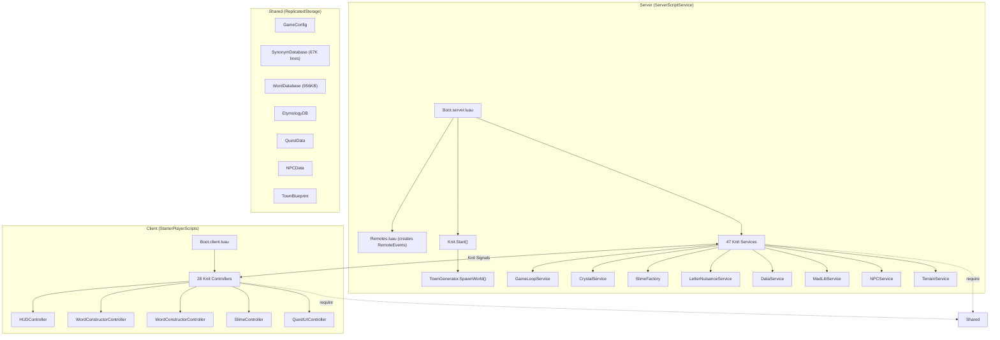

# Architecture Overview

## System Diagram



## Boot Sequence

```
1. Boot.server.luau runs
2. Creates emergency floor + trees
3. Waits for Packages/Knit (5s timeout)
4. ⚡ require(Remotes.luau) — creates all RemoteEvents
5. Loops through Services folder → require() each
6. Knit.Start()
7. After 3s delay → TownGenerator.SpawnWorld()
```

## Key Service Dependencies

| Service | Depends On (require) | Depends On (runtime) |
|---------|---------------------|---------------------|
| GameLoopService | Knit | CrystalService, SlimeFactory, MadLibService, LetterNuisanceService, DataService |
| CrystalService | Knit, Remotes | GameLoopService |
| LetterNuisanceService | Knit | CrystalService, GameLoopService |
| SlimeFactory | Knit, EtymologyDB, WordDatabase | DataService |
| TownGenerator | Knit, NPCData, TownBlueprint, BuildingStyles, BuildingInterior | NPCService, TerrainService |
| DataService | Knit | LogosService, SlimeFactory, CrystalService |

## File Counts

| Section | Files | Notes |
|---------|-------|-------|
| Server Services | 47 `.lua` | All use `Knit.CreateService` |
| Client Controllers | 28 `.lua` | All use `Knit.CreateController` |
| Client UI | 14 `.lua` | Plain modules, initialized by HUDController |
| Shared Modules | 22 `.lua` | Data, config, types, visual builders |
| Shared Data | 36 files | Lore, templates |
